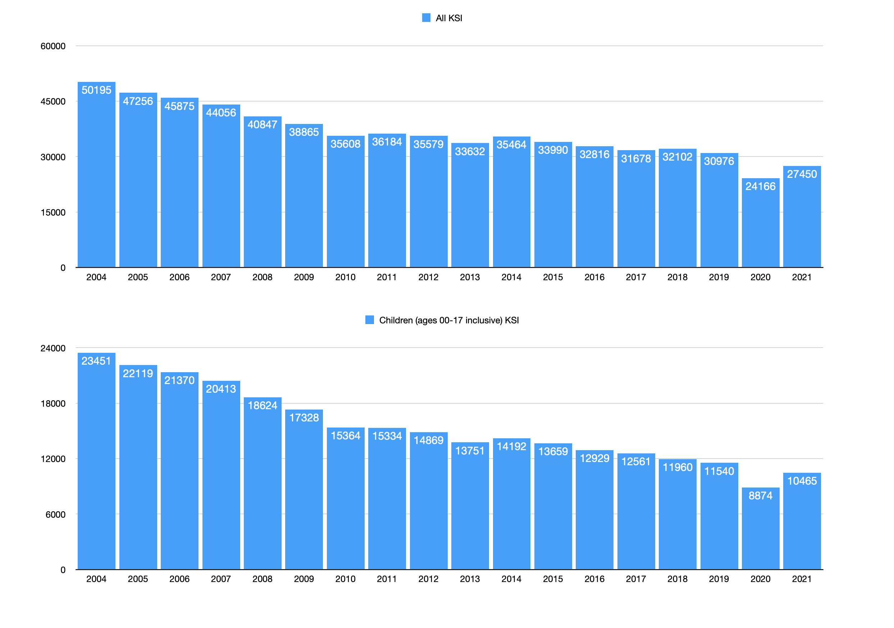

# People Killed or Seriously Injured (KSI) on UK Roads, 2004-2021

For various reasons I became interested in how many people had *not*
died on UK roads over the period of Coronavirus "lockdowns", and so
I pulled
[some numbers](https://roadtraffic.dft.gov.uk/custom-downloads/road-accidents/reports/14fa598f-ea9c-4e5d-8db4-d2a6d32ac70c)
from the
[relevant UK Department for Transport website](https://roadtraffic.dft.gov.uk/custom-downloads/road-accidents)
and reduced them using the python code shown below.

## Data Selection

The data chosen is the *Killed or seriously injured (KSI) adjusted*
data set, per the description:

> For analysis of trends over time across the country, using the
> experimental adjusted series is recommended. They are based on what
> we estimate the totals would be if all police forces were using
> injury-based severity reporting systems.

## Data Extract Process

* Visit: https://roadtraffic.dft.gov.uk/custom-downloads/road-accidents
* Select: *Casualties*
* Select: *Killed or seriously injured (KSI) adjusted*
* Select: *All Years*
* Select: *Great Britain, countries and regions*
* Select: *Great Britain*
* Select: *Casualty age*
* Select: *Confirm*
* Result: Your report reference is `14fa598f-ea9c-4e5d-8db4-d2a6d32ac70c`
* Link: [Data](https://roadtraffic.dft.gov.uk/custom-downloads/road-accidents/reports/14fa598f-ea9c-4e5d-8db4-d2a6d32ac70c)

## Other Relevant Documents

Amongst other sources, I found the
International Transport Forum of the OECD's
[Road Safety Report 2021, United Kingdom](https://www.itf-oecd.org/sites/default/files/united-kingdom-road-safety.pdf)
to be particularly useful.

## Overall Results

* across all age groups, 2020 saw `6810` fewer deaths than 2019
* across children ages 0 thru 17, 2020 saw `2666` fewer deaths than 2019

Per the ITF-OECD report:

> Similarly, large fatality reductions were seen during the recession
> in the early 1990s. However, traffic levels have risen again in
> recent years, surpassing pre-recession levels. This may be why
> casualty levels have plateaued at best, except in 2020.

Some of this is visible in the chart above, that since 2010 mortality
statistics have been almost flat, only gradually declining until the
lockdowns of 2020 occured; surprisingly this is in spite of rising
numbers of cars on the road (ITF numbers)

* year 2000: 29.629 million cars
* year 2010: 35.170 million cars
* year 2019: 39.891 million cars

...so it's quite impressive that numbers continue to decline in the
face of expanding car usage. Reductions likely include the results of
crackdowns on drink-driving and on speed, but also economic effects
such as young people being "priced out" of insurance, or even simply
moving to the cities and using more and greater variety of public 
transport, e.g. Uber.  It would be hard to generalise.

Also from the ITF come interesting statistics re: the numbers of
deaths per 100,000 population:

* year 2000: 6.1 road deaths per 100k
* year 2010: 3.0 road deaths per 100k
* year 2019: 2.7 road deaths per 100k
* year 2020: 2.3 road deaths per 100k

...which are fairly comparable to
[national rates for homicide](https://www.ons.gov.uk/peoplepopulationandcommunity/crimeandjustice/datasets/appendixtableshomicideinenglandandwales),
averaged for all genders:

* year ending March 2000: 1.29 homicide deaths per 100k
* year ending March 2010: 1.07 homicide deaths per 100k
* year ending March 2019: 1.08 homicide deaths per 100k
* year ending March 2021: 0.99 homicide deaths per 100k

## For Discussion

After a considerable period of "plateau" in improvements for child
protection on the roads, if it's possible to save considerably more
than 2000 children (and nearly 7000 people overall) from being killed
or seriously injured each year, why *not* re-impose national lockdowns
to achieve that goal?
